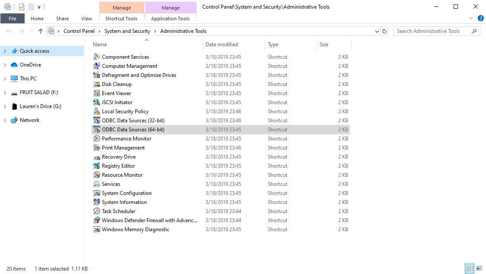
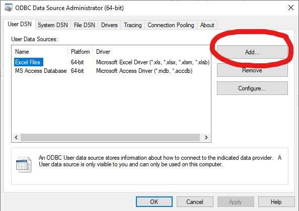
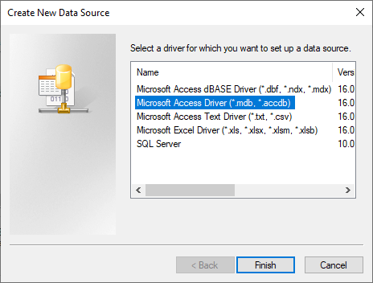
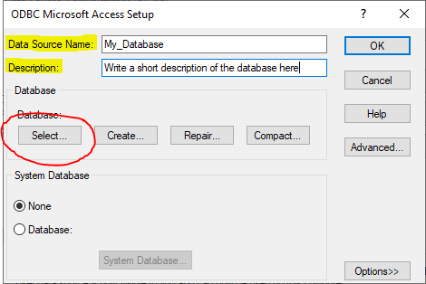
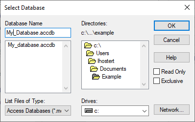
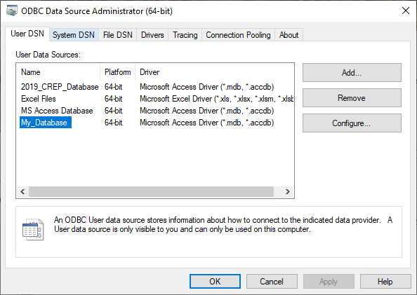

# Connecting R to a MS Access Database

## References

- R Studio - [Connect to a Database](https://db.rstudio.com/getting-started/connect-to-database)
- R Studio - [Troubleshooting Connections](https://support.rstudio.com/hc/en-us/articles/115011264307-Troubleshooting-Connections)
- MS Office Drivers - [Adding an ODBC data source](https://support.office.com/en-us/article/administer-odbc-data-sources-b19f856b-5b9b-48c9-8b93-07484bfab5a7)
- RDocumentation - [DBI Package](https://www.rdocumentation.org/packages/DBI/versions/0.5-1)
- RDocumentation - [odbc Package](https://www.rdocumentation.org/packages/odbc/versions/1.0.1)

## Definitions

**ODBC**: "Open Database Connectivity" is a standard API (application programming interface) for accessing database management systems

**DSN**: "Data Storage Name" is a configuration that contains information about a database connection. It has a name like "My_Database" and referes to a specific data source and specific driver.

## How to Connect your Access Database to R

### Create a MS Access Driver Specific for your Access DB

1. Click **Start**, and then click **Control Panel**  
  (You may need to search for **Control Panel** in the Windows Start Menu)
2. In the **Control Panel**, click **Administrative Tools**
3. In the **Administrative Tools** windows select **ODBC Data Sources (64-bit)** unless you want to make a 32-bit driver. This will be dependent on which version of Access you are running (32-bit or 64-bit).



4. For adding a database that is local to your computer select the **User DSN** tab and Click **Add**



5. Select the _"Microsoft Access Driver (\*.mdb, \*.accdb)"_ driver type to use, and then click **Finish**.



6. Follow the instructions and enter the "Data Source Name" and a short description of the database and click the "Select" button to navigate to the location of your database on your local machine.




7. Click **OK** in the **Select Database** window then **OK** in the **ODBC Microsoft Access Setup** window

8. You should now see your newly created database driver in the list of available __User Data Sources__



### Install and load packages in R

`install.packages(c("odbc", "DBI", "tidyverse"))`
    - Install packages if you do not already have them on your computer

`library(odbc))`
    - This is the library that will help DBI functions efficiently use the ODBC driver that you created in the earlier step. Without this it is more difficult for DBI fucntions to establish a connection between your Access DB and your R session.  
`library(DBI)`
    - This library will allow you to connect to the database and interact with it  
`library(tidyverse)`
        - This will load the base packages from the tidyverse including dplyr which can help you manipulate the data tables and run SQL queries

### Connect to your database

```R
connection <- DBI::dbConnect(odbc::odbc(), "My_Database")
dbListTables(connection) # Get the list of tables in the database that is now connected to your R session
odbc_result <- DBI::dbReadTable(connection, "Fish_Abundance") # Pull out specific tables from DB, in this case a Fish Abundance table
as_tibble(odbc_result) # Turn those tables into tibbles to use with dplyr functions
```

### Conducting queries

#### Using DBI and SQL

 Using DBI functions and an SQL query the result is a data.frame.

```R
fish_locations_sql_dbi <- DBI::dbGetQuery(connection, "SELECT DISTINCT Fish_Abundance.PU_Gap_Code, Fish_Abundance.Reach_Name, Fish_Abundance.Event_Date,
                                          Established_Locations.Site_Type, Established_Locations.Latitude,
                                          Established_Locations.Longitude, Established_Locations.Stream_Name
                                       FROM Fish_Abundance LEFT JOIN Established_Locations
                                       ON (Fish_Abundance.PU_Gap_Code = Established_Locations.PU_Gap_Code)
                                       AND (Fish_Abundance.Reach_Name = Established_Locations.Reach_Name)")
```

#### Using dplyr and SQL

Using dplyr functions and an SQL query the result is a tibble `data.frame`.

```R
fish_locations_sql_dplyr <- as_tibble(tbl(connection, sql("SELECT DISTINCT Fish_Abundance.PU_Gap_Code, Fish_Abundance.Reach_Name, Fish_Abundance.Event_Date,
                                          Established_Locations.Site_Type, Established_Locations.Latitude,
                                          Established_Locations.Longitude, Established_Locations.Stream_Name
                                       FROM Fish_Abundance LEFT JOIN Established_Locations
                                       ON (Fish_Abundance.PU_Gap_Code = Established_Locations.PU_Gap_Code)
                                       AND (Fish_Abundance.Reach_Name = Established_Locations.Reach_Name)")))
```
#### Using dplyr

Using dplyr functions and an SQL query the result is a tibble data.frame. Using this form you can use other functions from the tidyverse to summarize your data in the same code snippet.

```R
fish_locations_tidyverse <- as_tibble(tbl(connection, "Fish_Abundance")) %>%
  left_join(as_tibble(tbl(connection, "Established_Locations")), by = c("PU_Gap_Code", "Reach_Name")) %>%
  select(PU_Gap_Code, Reach_Name, Event_Date, Site_Type, Latitude, Longitude, Stream_Name) %>%
  distinct()
```

### Close the connection
 Finally, when you are finished interacting with the database close the connection.  
 `dbDisconnect(connection)`
